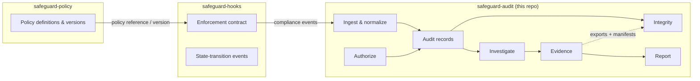
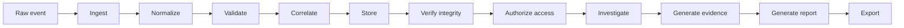

# Architecture

## The three-polyrepo model

Safeguard separates *what is allowed* from *what is enforced* from *what is
verified*:



**Why separate?** A policy engine that also stores evidence is tempted to
rewrite history to look right. An enforcement layer that also reports is
tempted to only report what it enforced. The audit layer exists so that
"what happened" is recorded by a component whose incentives are *opposite*:
it must preserve and expose history, including the parts that look bad —
and it has no authority to change what happens on-chain.

## The audit lifecycle



Every stage has a clear interface; no stage is welded to one event source,
one database, one RPC provider, or one report format. Events arrive through
an abstract source, records persist through the `EventStore` trait, and
Soroban/RPC/simulator specifics live behind adapters that speak normalized
types.

## Dependency direction

```text
adapters ──▶ domain services ──▶ audit-core ──▶ (nothing below)
                │
storage ◀───────┘   (EventStore trait consumed by services and adapters)
```

Concretely: `audit-events → audit-core`; `storage → audit-core`;
`memory-store → storage`; a future `soroban` adapter depends on
`audit-core`/`audit-events` — never the reverse. Core contains no database,
no RPC, and no protocol types.

## Phase map and module → home

The spec's planned module tree is implemented as the `crates/` libraries
that thin binaries (contract, CLI) compose later, exactly like the sibling
repos. Where a spec module landed elsewhere, this table says where:

| Spec module | Home |
| ----------- | ---- |
| audit-core modules (`record`, `event`, `integrity`, `authorization`, `correlation`, `privacy`, `identifiers`, `timestamps`, `pagination`, `errors`, `retention`, `investigation`, `evidence`, `report`, `audit`) | `crates/audit-core/src/` |
| audit-events modules (`compliance`, `transfer`, `freeze`, `authorization`, `policy`, `sanctions`, `investigation`, `audit`, `transaction`, `event_id`, `errors`) | `crates/audit-events/src/` |
| storage (`store`, `query`, `transaction`, `pagination`, `errors`); memory-store | `crates/storage`, `crates/memory-store` |
| schemas, fixtures, scripts, docs, governance | top-level directories |
| `interfaces/event-source/*.rs` etc. | interfaces are **cross-repo protocol references** (markdown), matching the sibling repos; provider-neutral *traits* live in the crates that own them (`EventStore` in `storage`). Phase 2 adds the `EventSource` trait home and the indexer. |
| `tests/`, `benches/`, `examples/`, `cli/`, `contracts/audit-registry`, later crates | land in later phases with their subsystems |

Phases:

1. **Domain foundation** — audit-core, audit-events, storage interface,
   memory store, schemas, fixtures, governance, CI. *Complete.*
2. **Event pipeline** — normalization, validation, ingestion, dedup,
   ordering, indexing, checkpointing (EventSource + indexer crates).
3. **Integrity** — canonical hashing implementation, chained digests,
   manifest generation, verification and tamper detection tooling.
4. **Authorization** — authorizer services over the core role/scope model,
   credential and access logging services.
5. **Investigation** — case services, timelines, findings.
6. **Evidence** — evidence generation, provenance, manifests, export.
7. **Reporting** — deterministic report generation for each report kind.
8. **Privacy** — redaction, classification enforcement, disclosure
   controls, the `DecryptionProvider` boundary.
9. **Stellar/Soroban** — the Soroban event adapter, RPC abstraction.
10. **Simulator** — the crucible-simulator bridge for deterministic tests.
11. **On-chain registry** — the minimal optional `audit-registry` contract
    (commitments only), if the architecture justifies it.
12. **Hardening** — security/privacy suites, fuzzing, benchmarks,
    reconciliation and replay verification.

Each phase closes with its documentation and CI surface; the README and
this file are updated as phases land.
